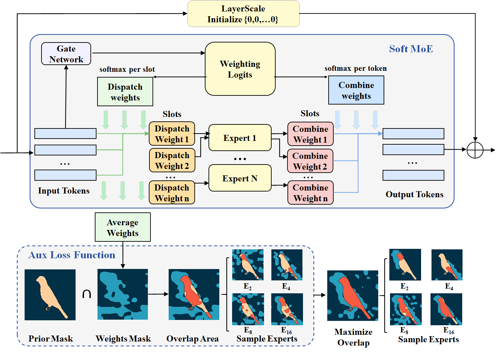

# 📌 Introduction
This repository contains the official implementation of the paper:

**Guiding the Experts: Semantic Priors for Efficient and Focused MoE Routing**

by Chengxi Min, Wei Wang, Yahui Liu, Weixin Ye, Enver Sangineto, Qi Wang, Yao Zhao.  

## 🖼️ Overview



## 🧠 Abstract

Mixture-of-Experts (MoE) models have emerged as a promising direction for scaling vision architectures efficiently. Among them, Soft MoE improves training stability by assigning each token to all experts via continuous dispatch weights. However, current designs overlook the semantic structure which is implicitly encoded in these weights, resulting in suboptimal expert routing. In this paper, we discover that dispatch weights in Soft MoE inherently exhibit segmentation-like patterns but are not explicitly aligned with semantic regions. Motivated by this observation, we propose a foreground-guided enhancement strategy. Specifically, we introduce a spatially aware auxiliary loss that encourages expert activation to align with semantic foreground regions. To further reinforce this supervision, we integrate a lightweight LayerScale mechanism that improves information flow and stabilizes optimization in skip connections. Our method necessitates only minor architectural adjustments and can be seamlessly integrated into prevailing Soft MoE frameworks. Comprehensive experiments on ImageNet-1K and multiple smaller-scale classification benchmarks not only showcase consistent performance enhancements but also reveal more interpretable expert routing mechanisms.

# 🚀 Getting Started

## Requirements
Install dependencies:

```bash
pip install -r requirements.txt
````

## Masks Datasets

### 🖼️ Foreground Masks

Our method requires foreground masks for training. You can obtain them as follows:

- **ImageNet-100** training masks can be downloaded from [this link](https://pan.baidu.com/s/1QWojsNKUnw1Ps4aNQFAPgg?pwd=gnm4).
- **ImageNet-1K** training masks will be released in a future update.

### 🔧 Usage Instructions

After downloading the `ImageNet-100` mask archive:

1. **Unzip** the file.
2. **Place** the unzipped folder into your dataset root directory.
3. **Rename** the folder to `train_mask`.

The final dataset structure should look like:

```
/path/to/ImageNet100/
├── train/
├── val/
└── train_mask/
```
Each mask file should correspond to an image in the `train/` directory using the same filename (e.g., `n01440764_123.JPEG` ↔ `n01440764_123.pth`).

## Training

```bash
 CUDA_VISIBLE_DEVICES=<GPU Indexs> torchrun --nproc_per_node=<GPU_Nums> --nnode=1 --master_port 12345 main_vit.py --cfg <Config Path>  --data <Datasets Path> --batch-size <Batch Size>  --output <Output Path>
```

## 📊 Results

| Datasets        |Baseline(Top@1 acc.) | Our Method(Top@1 acc.) |
|-----------------| -------------- |------------------------|
| Imagenet-1K     |  73.9%          | **74.5%**              |
| Imagenet-100    | 75.4%          | **76.8%**                  


## 🔧 Code Base

This project is built upon the following open-source repositories:

- [Swin-Transformer](https://github.com/microsoft/Swin-Transformer): Parts of the training pipeline are adapted from this project.
- [soft-mixture-of-experts](https://github.com/fkodom/soft-mixture-of-experts): The implemention of Soft MoE are borrowed from this project.
- [lang-segment-anything](https://github.com/luca-medeiros/lang-segment-anything): The pipline of masks generation are based on this project.

## 📬 Contact

For questions or collaborations:

* Name: Chengxi Min
* Email: 17388308697@163.com
